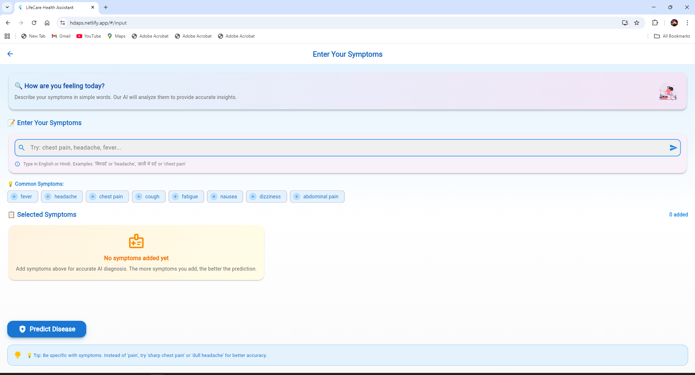
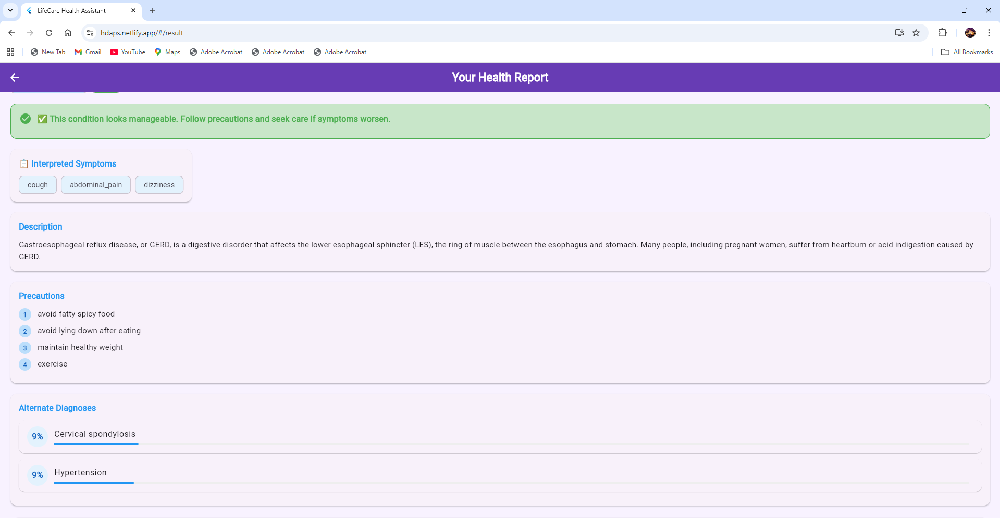

# 🏥 AI Health Assistant – Smart Medical Diagnosis Web App

<div align="center">


**🌐 Live Demo:** http://hdads.netlify.app 
**🎯 Accuracy:** 98%+  
**🦠 Diseases Covered:** 100+


A sophisticated AI-powered health diagnosis platform that analyzes symptoms and predicts diseases with high accuracy.

</div>

---

## ✨ Features

### 🎯 Core Capabilities
- 🤖 AI-Powered Diagnosis with 98%+ accuracy  
- 🌐 Multi-Language Support (English & Hindi)  
- 📱 Progressive Web App (Installable like native)  
- ⚡ Real-time Analysis  
- 🔍 Smart Fuzzy Symptom Detection  
- 📊 Professional PDF Medical Reports  

---

### 🩺 Medical Features
- ✅ 100+ Diseases Database  
- ✅ Severity Assessment (Low / Moderate / High / Critical)  
- ✅ Alternate Diagnoses with Probabilities  
- ✅ Precautions & Preventive Care  
- ✅ Follow-up Questions  
- ✅ Multilingual Symptom Input  

---

### 🎨 User Experience
- ✅ Modern UI/UX with Animations  
- ✅ Fully Responsive (Mobile/Web/Desktop)  
- ✅ Offline Partial Support  
- ✅ Dark Mode (Coming Soon)  
- ✅ Lottie Loading Animations  

---

## 🚀 Live Demo

<div align="center">

👉 **Try Now:** http://hdads.netlify.app

[](hdads.netlify.app)
[](https://github.com/yourusername/health-care-web/issues)

</div>

---

## 📸 Screenshots

### 🏠 Home Screen


---

### 📝 Symptom Input Screen


---

### 📊 Health Report Screen


---

## 🏗️ Architecture  

User Input → Flutter Web App
Flutter → Language Translation
Flutter → Symptom Normalization
Flutter → API Request
API → FastAPI Backend
FastAPI → ML Model
ML Model → Disease Prediction
Prediction → Response Processing
Response → Web Display
Results → PDF Report Generation


---

## 📁 Project Structure


health-care-web/
├── lib/
│ ├── main.dart
│ ├── controllers/
│ ├── models/
│ ├── services/
│ ├── views/
│ ├── widgets/
│ └── theme/
├── assets/
├── web/
├── build/
└── backend/


---

## 🚀 Quick Start

### ✅ Prerequisites
- Flutter ≥ 3.0.0
- Dart ≥ 2.19.0
- Python ≥ 3.8

---

### ✅ Frontend Setup

```bash
git clone https://github.com/yourusername/health-care-web.git
cd health-care-web
flutter pub get
flutter run -d chrome

✅ Build for Production
flutter build web --web-renderer canvaskit --release
cd build/web
python -m http.server 8000

✅ Backend Setup
cd backend
python -m venv venv
source venv/bin/activate   # Mac/Linux
venv\Scripts\activate      # Windows
pip install -r requirements.txt
python mainV4.py

📊 API Documentation
Endpoint
POST /predict

Request
{
  "symptoms": ["fever", "headache", "cough"]
}

Response
{
  "predicted_disease": "Common Cold",
  "disease_seriousness": "low",
  "severity_score": 15,
  "confidence_score": 0.85,
  "description": "A viral infection of the upper respiratory tract...",
  "precautions": ["Rest well", "Drink plenty of fluids"],
  "alternate_diagnoses": [
    {"disease": "Influenza", "prob": 0.12}
  ],
  "suggested_questions": [
    "Do you have a sore throat?"
  ]
}

📈 Performance Metrics
Metric	Value	Status
Page Load	< 2s	✅
API Response	< 1s	✅
Lighthouse	95+	✅
PWA Score	100%	✅
🚀 Deployment
Netlify (Current)
flutter build web --web-renderer canvaskit --release
netlify deploy --dir=build/web --prod

📄 License

MIT License

🙏 Acknowledgments

Flutter Team

FastAPI

Scikit-learn

Netlify

Render

<div align="center">

⭐ If you like this project, please give it a star! ⭐
Built with ❤️ by Saransh Sharma

</div> ```


